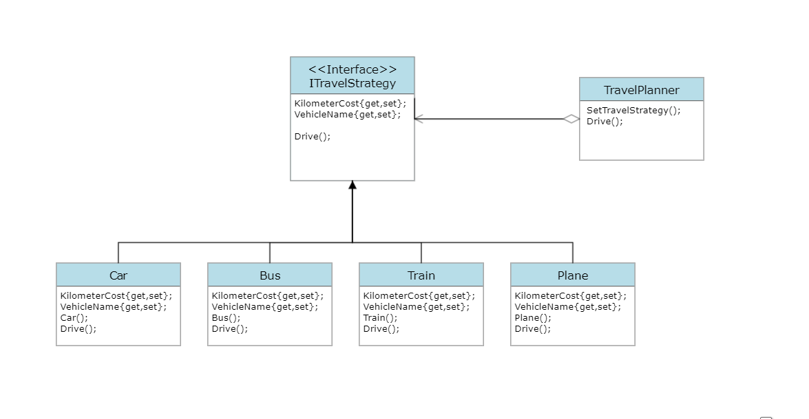

# Overview
Software design patterns are programming paradigms that describe reusable patterns for common design problems. They are a set of tried and tested solutions to common problems in software design. They are not algorithms or code snippets that can be copied and pasted into your code. They are more like templates that can be applied to different situations. They are not a substitute for good software design principles, but they are a good starting point for designing your software. They are a good way to document your design decisions. They are a good way to communicate your design to other developers.

The Strategy design pattern is a behavioral design pattern that allows us to define different functionalities, put each functionality in a separate class and make their objects interchangeable.In other words, we have a main Context object that holds a reference towards a Strategy object and delegates it by executing its functionality. If we want to change the way the Context performs its work, we can just replace the current Strategy object with another one.

In Real life applications of Strategy design pattern like  a simple traveler app using a strategy method involves designing a flexible system for travelers to choose their transportation methods like travel by bus, car, train or plane and calculate the travel cost.

# Design

# Environment
The project builds and runs with Visual Studio Community 2022 when the required workloads are installed.

